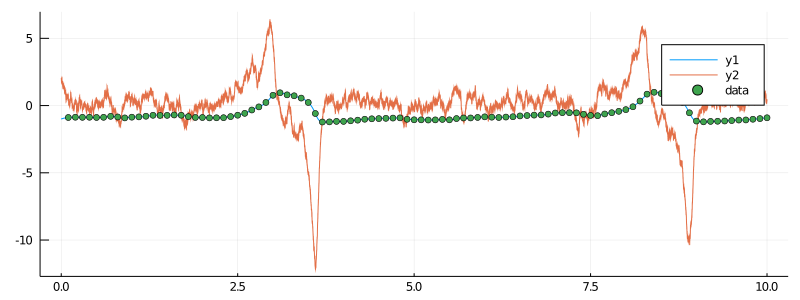
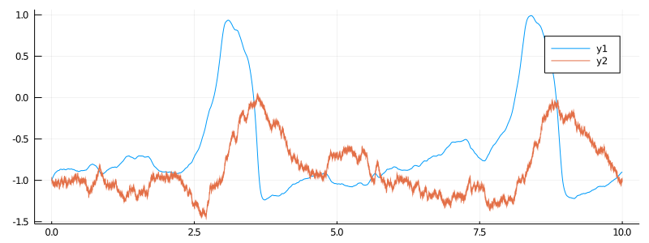
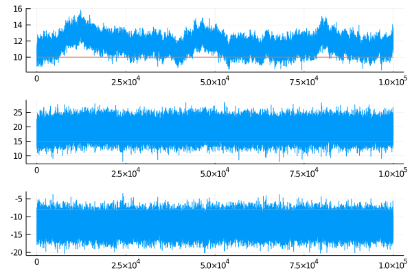

# Conjugate updates for the FitzHugh–Nagumo model
*****
> In this tutorial we will do parameter inference for the partially observed hypoelliptic version of the FitzHugh–Nagumo model using conjugate Gaussian updates.

## Reparameterization
----
The ordinarily parameterized FitzHugh–Nagumo model:
```math
\begin{align*}
\dd Y_t &= \frac{1}{\epsilon}\left( Y_t - Y_t^3-X_t + s \right )\dd t,\\
\dd X_t &= \left( \gamma Y_t - X_t + \beta \right )\dd t + \sigma \dd W_t,
\end{align*}
```
is not ideal for conjugate updates, as parameter $ϵ$ cannot be updated with this method. However, it is possible to slightly reparameterize the model so that three parameters:
$(ϵ,s,γ)$ can be updated at once. The reparameterized model is given by the following SDE:
```math
\begin{align*}
\dd Y_t &= \dot{Y}_t \dd t,\\
\dd\dot{Y}_t &= \left( (\epsilon-\gamma)Y_t -\epsilon Y_t^3 -\dot{Y}_t + s - \beta + \epsilon\left( 1-3Y_t^2 \right)\dot{Y}_t \right)\dd t + \sigma \dd W_t.
\end{align*}
```

and can be loaded in with
```julia
using DiffusionDefinition
@load_diffusion FitzHughNagumoConjug
```

For more information about the reparameterization see [this page](https://juliadiffusionbayes.github.io/DiffusionDefinition.jl/dev/predefined_processes/fitzhugh_nagumo/).


## Preparation
-----
Before we can start doing any inference we should perform the same preparatory steps as we did in the [previous tutorial](@ref tutorials_start). Thus, before proceeding any further make sure that you've loaded the libraries and simulated the data. Note that the data can be simulated as before:
```julia
using DiffusionDefinition
const DD = DiffusionDefinition
@load_diffusion FitzHughNagumo
θ = [0.1, -0.8, 1.5, 0.0, 0.3]
P = FitzHughNagumo(θ...)
```
i.e. using the original parameterization, or equivalently, using the new one:
```julia
@load_diffusion FitzHughNagumoConjug
θ = [10.0, -8.0, 15.0, 0.0, 3.0]
```
Just make sure you transform the starting point accordingly via:
```math
\left(
    \begin{matrix}
        y_0^{(\texttt{new})}\\
        x_0^{(\texttt{new})}
    \end{matrix}
\right) =
    \left(
        \begin{matrix}
        y_0^{(\texttt{old})}\\
        \frac{1}{ϵ^{(\texttt{old})}}
            \left[
                y_0^{(\texttt{old})}
                -\left(y_0^{(\texttt{old})}\right)^3
                -x_0^{(\texttt{old})}+s^{(\texttt{old})}
            \right]
        \end{matrix}
    \right),
```
so that the old point
```math
(y_0^{(\texttt{old})},x_0^{(\texttt{old})})=(-1,-1),
```
becomes
```math
(y_0^{(\texttt{new})},x_0^{(\texttt{new})})=(-1,2).
```

Below, we summarize the steps of loading in the libraries, simulating the data and preparing the observations. Note that this time, because we will want to deal with a harder problem of simultaneous estimation of three parameters we will make our lives a little easier and decrease the standard deviation of the noise on the observations by one order of magnitude.
```julia
# load in all relevant libraries
using DiffusionMCMC, ExtensibleMCMC, GuidedProposals
using DiffusionDefinition, ObservationSchemes
const DD = DiffusionDefinition
const eMCMC = ExtensibleMCMC

using StaticArrays, Plots
using OrderedCollections, GaussianDistributions

@load_diffusion FitzHughNagumoConjug

# generate some data
θ = [10.0, -8.0, 15.0, 0.0, 3.0]
P = FitzHughNagumoConjug(θ...)
tt, y1 = 0.0:0.0001:10.0, @SVector [-1.0, 2.0]
X = rand(P, tt, y1)
data = map(
    x->(x[1], x[2][1] + 0.01randn()),
    collect(zip(X.t, X.x))[1:1000:end]
)[2:end]

# and let's see how they look
plot(X, Val(:vs_time), size=(800, 300))
scatter!(getindex.(data, 1), getindex.(data, 2), label="data")
```


!!! tip
    The plot above is not very transparent as the ranges of coordinates are not really compatible for displaying on the same plot. One way to deal with this (which has an additional benefit of being more comparable to our previous tutorial) is to transform the second coordinate back to the original parameterization and plot that:

    ```julia
    plot(X.t, getindex.(X.x, 1), size=(800, 300))
    x_old = -1.0/P.ϵ .* getindex.(X.x, 2) .+ getindex.(X.x, 1) .- getindex.(X.x, 1) .^ 3 .+ P.s/P.ϵ
    plot!(X.t, x_old)
    ```

    

```julia
# finally, prepare the data
recording = (
    P = P,
    obs = load_data(
        ObsScheme(
            LinearGsnObs(
                0.0, (@SVector [0.0]);
                L=(@SMatrix [1.0 0.0]), Σ=(@SMatrix [1e-4])
            )
        ),
        data
    ),
    t0 = 0.0,
    x0_prior = KnownStartingPt(y1),
)
observs = AllObservations()
add_recording!(observs, recording)
init_obs, _ = initialize(observs)
```

## Inference
----

```julia

@load_diffusion FitzHughNagumoConjugAuxSimple

DD.const_parameter_names(::Type{<:FitzHughNagumoConjug}) = (:β, :σ)
DD.const_parameter_names(::Type{<:FitzHughNagumoConjugAuxSimple}) = (:σ, :t0, :T, :vT, :xT)

# and do the inference
mcmc_params = (
    mcmc = MCMC(
        [
            PathImputation(
                0.99, FitzHughNagumoConjugAuxSimple;
                adpt=AdaptationPathImputation(;
                    adapt_every_k_steps = 50,
                    scale = 0.05,
                ),
            ),
            DiffusionConjugGsnUpdate(
                [1,2,3],
                Gaussian(
                    (@SVector [0.0, 0.0, 0.0]),
                    SDiagonal(1e4, 1e4, 1e4),
                ),
            )
        ];
        backend=DiffusionMCMCBackend(),
    ),
    num_mcmc_steps = Integer(1e5),
    data = initialize(observs)[1],
    θ_init = OrderedDict(
        :REC1_ϵ => 10.0 , # param 1
        :REC1_γ => 15.0 , # param 2
        :REC1_s => -8.0 , # param 3
    ),
)

mcmc_kwargs = (
    path_buffer_size = 10,
    dt = 0.001,
)
```


```julia
# run the MCMC
@time ws = run!(mcmc_params...; mcmc_kwargs...)
```
It takes about 1min 30sec to run on my laptop.

```julia
# inspect the results
θθ = [map(x->x[2][i], ws[1].sub_ws.state_history) for i in 1:3]
plot(θθ, layout=(3,1))
plot!([[0,1e5], [0,1e5], [0,1e5]], [[10, 10], [15, 15], [-8,-8]])
```

