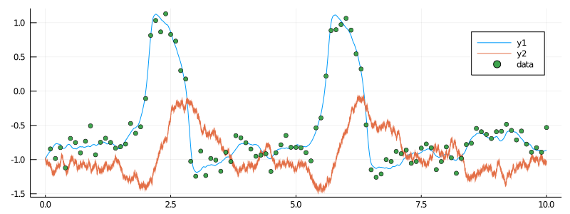
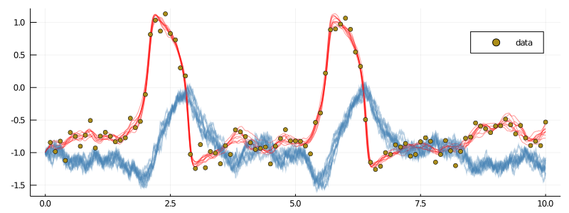
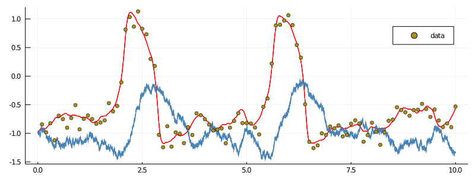
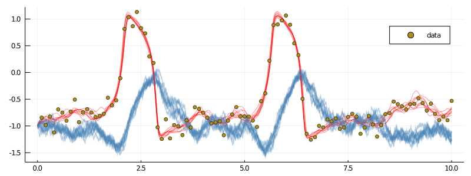
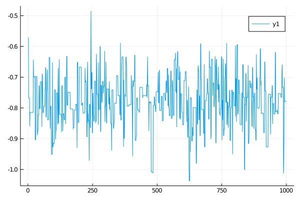
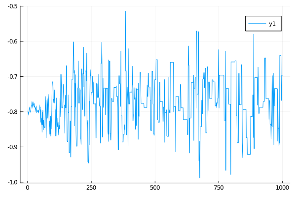

# [Inference and smoothing for the FitzHugh–Nagumo model](@id tutorials_start)
**********
> In this tutorial we will do smoothing and parameter inference for the partially observed hypoelliptic version of the FitzHugh–Nagumo model.

## Preparation
-----
Before we can start doing smoothing or inference we need to
- load in the relevant libraries
- generate some data
- and finally, decorate the data using [ObservationSchemes.jl](https://juliadiffusionbayes.github.io/ObservationSchemes.jl/dev/)

### Prerequisite libraries
We simply load the necessary tools from [JuliaDiffusionBayes](https://github.com/JuliaDiffusionBayes) and some additional libraries for using StaticArrays, plotting, and defining an ordered dictionary. We may also define alias names for easy access to functions that are not exported, but need to be accessed
```julia
using DiffusionMCMC, ExtensibleMCMC, GuidedProposals
using DiffusionDefinition, ObservationSchemes
const DD = DiffusionDefinition
const eMCMC = ExtensibleMCMC

using StaticArrays, Plots
using OrderedCollections
```

### Simulating some data
For this tutorial we will simulate some artificial data using the FitzHugh–Nagumo model. This diffusion process is already defined in [DiffusionDefinition.jl](https://juliadiffusionbayes.github.io/DifusionDefinition.jl/dev/), so we may simply load it in.
```julia
@load_diffusion FitzHughNagumo

# generate some data
θ = [0.1, -0.8, 1.5, 0.0, 0.3]
P = FitzHughNagumo(θ...)
tt, y1 = 0.0:0.0001:10.0, @SVector [-1.0, -1.0]
X = rand(P, tt, y1)
data = map(
    x->(x[1], x[2][1] + 0.1randn()),
    collect(zip(X.t, X.x))[1:1000:end]
)[2:end]

# and let's see how they look
plot(X, Val(:vs_time), size=(800, 300))
scatter!(getindex.(data, 1), getindex.(data, 2), label="data")
```


### Data preparation
The final step before doing smoothing or inference is to arrange the data in a format that will be understood by the MCMC sampler. This is done by decorating each observation with additional information about how it was collected adding information about the underlying law and the starting position, and finally, packaging it as a recording and putting into an `AllObservations` struct. All of this can be done using the package [ObservationSchemes.jl](https://juliadiffusionbayes.github.io/ObservationSchemes.jl/dev/). For more details see [...].
```julia
recording = (
    P = P,
    obs = load_data(
        ObsScheme(
            LinearGsnObs(
                0.0, (@SVector [0.0]);
                L=(@SMatrix [1.0 0.0]), Σ=(@SMatrix [0.01])
            )
        ),
        data
    ),
    t0 = 0.0,
    x0_prior = KnownStartingPt(y1),
)
observs = AllObservations()
add_recording!(observs, recording)
init_obs, _ = initialize(observs)
```

## Smoothing
-----
Smoothing is simply sampling of unobserved path-segments according to the diffusion law conditioned on already made observations. To do it we simply need to define an MCMC chain that does imputation of paths and no updates to parameters.

We will need to pass an auxiliary law (think of it as a linear approximation to the target diffusion law) and indicate via backend that we wish to use algorithms from [DiffusionMCMC.jl](https://juliadiffusionbayes.github.io/DiffusionMCMC.jl/dev/) and not only those from [ExtensibleMCMC.jl](https://juliadiffusionbayes.github.io/ExtensibleMCMC.jl/dev/).
```julia
# auxiliary law
@load_diffusion FitzHughNagumoAux

# main definition of an MCMC algorithm
mcmc_params = (
    mcmc = MCMC(
        [
            # sampling of paths with a precond. Crank–Nicolson parameter ρ=0.96
            PathImputation(0.96, FitzHughNagumoAux),
        ];
        backend=DiffusionMCMCBackend(),
    ),
    num_mcmc_steps = Integer(1e3),
    data = init_obs,
    θinit = nothing, # no inference
)
```

We will also size a buffer that holds a thinned chain of sampled paths and define a grid-width for sampling diffusion paths.
```julia
# some additional parameters for the MCMC chain
mcmc_kwargs = (
    path_buffer_size = 10,
    dt = 0.001,
)
```

We can now run the chain.
```julia
# run the MCMC
glob_ws, loc_ws = run!(mcmc_params...; mcmc_kwargs...)
```
It takes about 0.5sec on my laptop...

### Results
The paths are saved in an `XX_buffer` in a global workspace:
```julia
xs = glob_ws.XX_buffer.XX
```

Plotting them is simple enough:
```julia
p = plot(size=(800, 300))
for i in 1:10
    plot!(p, xs[i][1], Val(:vs_time), color=["red" "steelblue"], label=false, alpha=0.4)
end
scatter!(p, getindex.(data, 1), getindex.(data, 2), label="data")
display(p)
```


### Adaptation
Guessing the right value for the memory parameter $ρ$ of the preconditioned Crank–Nicolson scheme might be tricky. Having a reasonable value for $ρ$ is however essential, as the following example illustrates:
```julia
mcmc_params = (
    mcmc = MCMC(
        [
            # sampling of paths with a precond. Crank–Nicolson parameter ρ=0.1
            PathImputation(0.1, FitzHughNagumoAux),
        ];
        backend=DiffusionMCMCBackend(),
    ),
    num_mcmc_steps = Integer(1e4),
    data = init_obs,
    θinit = nothing, # no inference
)
```
This time we set $ρ=0.1$ and run the chain for $10$ times longer than previously.
```julia
glob_ws, loc_ws = run!(mcmc_params...; mcmc_kwargs...)
```

When we plot the last $10$ paths from a thinned chain however, notice what happens:

```julia
xs = glob_ws.XX_buffer.XX
p = plot(size=(800, 300))
for i in 1:10
    plot!(p, xs[i][1], Val(:vs_time), color=["red" "steelblue"], label=false, alpha=0.4)
end
scatter!(p, getindex.(data, 1), getindex.(data, 2), label="data")
display(p)
```


It seems that there is only one path! If we inspect the acceptance rate from the last $500$ proposals we immediately see what's wrong:
```julia
julia> (sum(loc_ws[1].acceptance_history[end-500:end])/500)[1]
0.0
```
The acceptance rate is $0.0$. We keep proposing new paths but most of them are simply not good enough and we end up staying where we were!

Finding the right $ρ$ is therefore **very** important. However, it becomes particularly challenging when the number of recordings grows (and we should guess the right value for each one of those) and when we do parameter inference on top of smoothing (as then, different local values of parameters might have drastically different optimal values for $ρ$). To alleviate this problem it is possible to employ adaptive schemes that target acceptance rate of the preconditioned Crank–Nicolson scheme and find $ρ$ automatically. To use them, simply pass a relevant flag:
```julia
mcmc_params = (
    mcmc = MCMC(
        [
            # sampling of paths with a precond. Crank–Nicolson parameter ρ=0.1
            PathImputation(
                0.1, FitzHughNagumoAux;
                adpt=AdaptationPathImputation(;
                    adapt_every_k_steps = 50,
                    scale = 0.2,
                )
            ),
        ];
        backend=DiffusionMCMCBackend(),
    ),
    num_mcmc_steps = Integer(1e4),
    data = init_obs,
    θinit = nothing, # no inference
)
glob_ws, loc_ws = run!(mcmc_params...; mcmc_kwargs...)
```
First, notice that the acceptance rate of the last $500$ draws looks much more encouraging
```julia
julia> (sum(ws[2][1].acceptance_history[end-500:end])/500)[1]
0.252
```
Indeed, the chain has started from $ρ=0.1$, but over the course of sampling, it reached a region of $ρ∼0.95$--$0.97$ and stayed there. The last $10$ saved paths look much better now
```julia
xs = glob_ws.XX_buffer.XX
p = plot(size=(800, 300))
for i in 1:10
    plot!(p, xs[i][1], Val(:vs_time), color=["red" "steelblue"], label=false, alpha=0.4)
end
scatter!(p, getindex.(data, 1), getindex.(data, 2), label="data")
display(p)
```



## Inference
----
If some parameters of the underlying process are unknown, then we may perform inference for it by appending the list of MCMC steps with those that update parameters. **Note that the step of imputing the unobserved paths still needs to be present!**

Suppose that we do not know the true value of parameter $s$ and we wish to estimate it. To this end, we first specify the parameters which are constat
```julia
# let's declare which parameters are not changing
DD.const_parameter_names(::Type{<:FitzHughNagumo}) = (:ϵ, :γ, :β, :σ)
DD.const_parameter_names(::Type{<:FitzHughNagumoAux}) = (:ϵ, :γ, :β, :σ, :t0, :T, :vT, :xT)
```
and re-initialize the data so that an appropriate dependence structure is built internally.
```julia
# and initialize for those constant parameters
init_obs, _ = initialize(observs)
```
An important point is revealed by calling:
```julia
julia> ObservationSchemes.print_parameters(init_obs)

There are 1-many independent recordings.
There are also 1-many variable parameters.
* * *
You may define the var-parameters using the following template:
# start of template
using OrderedCollections

θ_init = OrderedDict(
    :REC1_s => ... , # param 1
)
# end of template
and in an MCMC setting you may let your parameter update step
refer to a subset of indices you wish to update using the order
given above.
* * *
```
**We should always pass the initial guess for the parameters in the format specified by `print_parameters`.**

We can now parameterize the algorithm
```julia
mcmc_params = (
    mcmc = MCMC(
        [
            PathImputation(0.96, FitzHughNagumoAux),
            RandomWalkUpdate(UniformRandomWalk([0.3]), [1]),
        ];
        backend=DiffusionMCMCBackend(),
    ),
    num_mcmc_steps = Integer(1e3),
    data = init_obs,
    θinit = OrderedDict(
        :REC1_s => -0.8,
        #NOTE currently we must start from the same parameter that was set in AllObservations,
        #TODO relax this in the near future.
    ),
)
```
and run the sampler
```julia
glob_ws, loc_ws = run!(mcmc_params...; mcmc_kwargs...)
```
We can plot the chain as follows:
```julia
plot(map(x->x[2][1], glob_ws.sub_ws.state_history))
```


### Update steps from [ExtensibleMCMC.jl](https://juliadiffusionbayes.github.io/ExtensibleMCMC.jl/dev/)
An important thing to mention is that any update from [ExtensibleMCMC.jl](https://juliadiffusionbayes.github.io/ExtensibleMCMC.jl/dev/) will work for the parameter update step with diffusions. In particular we may use adaptive schemes:
```julia
mcmc_params = (
    mcmc = MCMC(
        [
            PathImputation(0.96, FitzHughNagumoAux),
            RandomWalkUpdate(
                UniformRandomWalk([0.01]), [1];
                adpt=AdaptationUnifRW( # seems that doesn;t work
                    [0.0];
                    adapt_every_k_steps=50,
                    scale=0.05,
                ),
            ),
        ];
        backend=DiffusionMCMCBackend(),
    ),
    num_mcmc_steps = Integer(1e3),
    data = init_obs,
    θinit = OrderedDict(
        :REC1_s => -0.8,
        #NOTE currently we must start from the same parameter that was set in AllObservations,
        #TODO relax this in the near future.
    ),
)

glob_ws, loc_ws = run!(mcmc_params...; mcmc_kwargs...)
```


but also many others. See [...] for an overview of choices.
